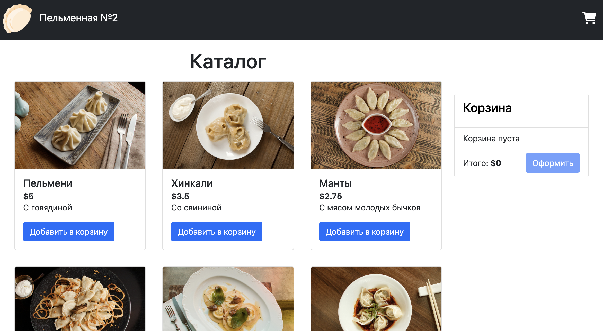
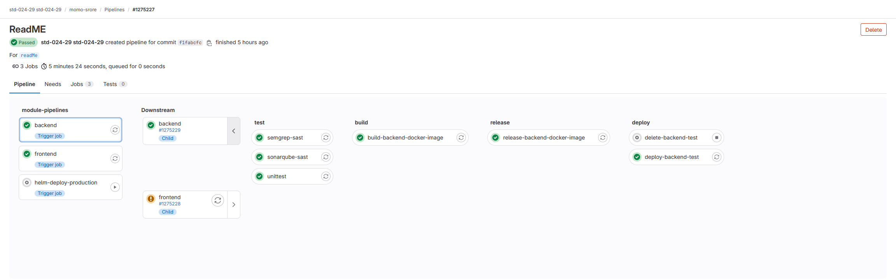
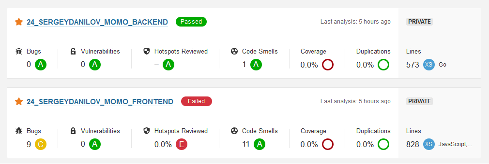
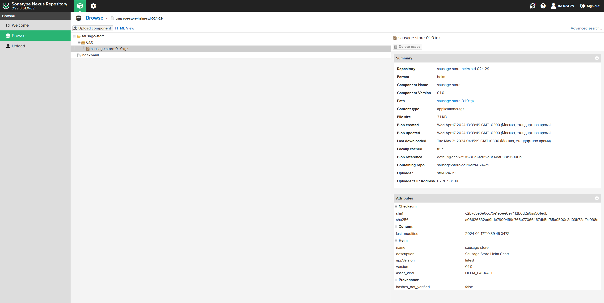

# Momo Store aka Пельменная №2
***URL:*** https://momo-store.torolfr.ru/

## Стек технологий
### Приложение
- **Работа с кодом**: Git
- **Frontend**: HTML, CSS, Vue, Ts, Js
- **Backend**: Go
- **Хранение медиа файлов**: S3
- **CI/CD**: Gitlab CI
- **Контейнеризация**: Docker
- **Тесты**: Unit, Gitlab SAST, SonarQube
- **Репозиторий**: Gitlab CI, Nexus

### Инфраструктура
- **Облако**: Яндекс.Облако
- **Контейнеризация**: Docker
- **Оркестратор**: Kubernetes
- **Инфраструктура**: Terraform, S3
- **Репозиторий**: Nexus
- **CI/CD**: Gitlab CI
- **Веб-сервер**: Ingress-controller, Network Load Balancer, Cert-manager, DNS, Nginx
- **Деплой**: Helm
- **Работа с кодом**: Git, Gitlab CI, IaC

## Струтктура проекта
```bash
|
├── backend                       - исходный код бэкэнда, Dockerfile, gitlab-ci.yml
├── frontend                      - исходный код фронтэнда, Dockerfile, gitlab-ci.yml
├── images                        - служебные изображения                   
├── infra                         - helm-чарты для развертывания приложения momo-store в k8s кластере
|   ├── kubernetes                - скрипты для разворачивания дополнительной инфраструктуры в k8s кластере
|   ├── momo-store-chart          - helm-чарты для развертывания приложения momo-store в k8s кластере
|   ├── terraform                 - конфигурационные файлы terraform для развертывания кластера
├── .gitlab-ci.yml                - родительский пайплайн для сборки, тестирования и релиза образов бэкенда и фронтенда
└── docker-compose.yaml           - конфиигурация для разворачивания приложения на тестовом стенде
```
## Разворачивание инфраструктуры в Yandex Cloude
### Terraform
1) Создайте сервисный аккаунт с ролью editor
2) Создайте статический ключ доступа (access_key и secret_key) для сервисного аккаунта
3) Создайте bucket с приватным доступом для хранения состояния terraform - momo-store-terraform-state
4) Инициализируйте terraform с бэкендом в бакете яндекс-облака:
```bash
export ACCESS_KEY="<идентификатор_ключа>"
export SECRET_KEY="<секретный_ключ>"
terraform init -backend-config="access_key=$ACCESS_KEY" -backend-config="secret_key=$SECRET_KEY"
```
5) Присвойте значения переменных в файле variables.tf
6) provider.tf - конфигурация провайдера
7) main.tf - основная конфигурация. Создание ресурсов в Yandex Cloud (Сеть, подсеть, группа безопасности, ключ шифрования, кластер, ноды, сервисный пользователь для упралвения кластером)
8) Создайте IAM-токен:
```bash
export YC_TOKEN=$(yc iam create-token)  && echo $YC_TOKEN
```
9) Cоздайте ресуры в облаке Yandex Cloude:
```bash
terraform plan -var="token=YC_TOKEN"
terraform apply -var="token=YC_TOKEN"
```
10) Дополнительно:
- [Начало работы с Terraform](https://yandex.cloud/ru/docs/tutorials/infrastructure-management/terraform-quickstart)
- [Создание сервисного аккаунта](https://yandex.cloud/ru/docs/iam/operations/sa/create)
### K8s cluster
1) Настройте /.kube/config
```bash
yc managed-kubernetes cluster list
CLUSTER_ID="<cluster id>"
yc managed-kubernetes cluster get-credentials --id $CLUSTER_ID --external
```
2) Проверьте доступность кластера:
```bash
kubectl cluster-info
```
3) Сделайте бэкап текущего ./kube/config:
```bash
cp ~/.kube/config ~/.kube/config.bak
```
4) Cоздайте администратора в K8s cluster с помощью sa.yaml из infra/kubernetes. Он понадобится в дальнейшем:
```bash
kubectl apply -f sa.yaml
```
5) Получите endpoint вашего K8s cluster: публичный ip адрес находится по пути Managed Service for Kubernetes/Кластеры/ваш_кластер -> обзор -> основное -> Публичный IPv4
6) получите KUBE_TOKEN:
```bash
kubectl -n kube-system get secrets -o json | jq -r '.items[] | select(.metadata.name | startswith("gitlab-admin")) | .data.token' | base64 --decode
```
7) Создайте новый ./kube/config:
```bash
export KUBE_URL=https://<см. пункт выше>   # Важно перед IP указать https://
export KUBE_TOKEN=<см.пункт выше>
export KUBE_USERNAME=gitlab-admin
export KUBE_CLUSTER_NAME=<id_кластера> как в пункте_3
kubectl config set-cluster "$KUBE_CLUSTER_NAME" --server="$KUBE_URL" --insecure-skip-tls-verify=true
kubectl config set-credentials "$KUBE_USERNAME" --token="$KUBE_TOKEN"
kubectl config set-context default --cluster="$KUBE_CLUSTER_NAME" --user="$KUBE_USERNAME"
kubectl config use-context default
```
8) Дополнительно:
- [Создание статического файла конфигурации](https://yandex.cloud/ru/docs/managed-kubernetes/operations/connect/create-static-conf)
### Установка Vertical Pod Autoscaler
```bash
cd /tmp && \
  git clone https://github.com/kubernetes/autoscaler.git && \
  cd autoscaler/vertical-pod-autoscaler/hack && \
  ./vpa-up.sh
```
### Установка Ingress-контроллера NGINX с менеджером для сертификатов Let's Encrypt
1) Выполните действия согласно инструкции:
 - [Установка Ingress-контроллера NGINX с менеджером для сертификатов Let's Encrypt](https://yandex.cloud/ru/docs/managed-kubernetes/tutorials/ingress-cert-manager)
##### Примечание
> В инструкциях в предварительных шагах необходимо создавать сервисный аккаунт и добавлять ему роли, например, editor, load-balancer.admin на каталог и др. Используйте один сервисный аккаунт, который создал terraform в первом шаге. В данном примере это сервисный пользователь ***zonal-k8s-account***
2) Узнайте IP-адрес Ingress-контроллера (значение EXTERNAL-IP)
```bash
kubectl get svc
```
### Настройка домена
1) Зарегистрировать домен для приложения
2) Указать адреса серверов имен Yandex Cloud в DNS-записях вашего регистратора:
- ns1.yandexcloud.net
- ns2.yandexcloud.net
_________________________________________________________________________________________________________________
## Публикация приложения
### Публикация приложения ручным способом
1) Собрать docker images для momo-backend и momo-frontend с помощью [docker image build](https://docs.docker.com/reference/cli/docker/image/build/)
2) Задайте в файле values.yaml fqdn и images
1) Установите приложение momo-store:
```bash
helm upgrade --install momo-store --atomic --timeout 15m ./momo-store-chart
```
### Публикация приложения CI/CD
В корневой директории проекта находится файл .gitlab-ci.yml, который отслеживает изменения в директориях backend, frontend и momo-store-chart. В случае изменения запускается процесс CI/CD. Процесс CI/CD состоит из следующих этапов:
1) build - упаковка приложения в Docker-образ. Полученные образы frontend и backend версионируются

2) test - тестирование SAST, SonarQube, unittest

3) release:
- Полученные образы frontend и backend помещаются в Gitlab Container Registry
- Формируется helm-чарт, который загружается в helm-репозиторий Nexus

4) deploy:
- Выполняется установка (пересоздание) приложения на тестовом стенде
- Выполняется установка (обновление) приложения, используя новый helm-чарта

Переменные, которые задаются для CI/CD:

| Элемент | Значение |
|--------------|-----------|
| `DEV_HOST` | IP адрес или FQDN стенда для тестирования приложения |
| `DEV_USER` | Пользователь для удаленного подключения к `DEV_HOST` с правами администратора |
| `KUBECONFIG` | Конфигурация для подключения к K8s Cluster |
| `NEXUS_REPO_PASSWORD` | Пароль для доступа к Nexus репозиторию |
| `NEXUS_HELM_REPO` | URL репозитория Helm-chart'ов деплоя приложения |
| `NEXUS_REPO_USER` | Имя пользователя для доступа к Nexus репозиторию |
| `SONAR_LOGIN_BACK` | Имя пользователя для доступа тестирования `SONARQUBE` backend |
| `SONAR_LOGIN_FRONT` | Имя пользователя для доступа тестирования `SONARQUBE` frontend |
| `SONAR_PROJECT_KEY_BACK` | Ключ авторизации пользователя для доступа тестирования `SONARQUBE` backend |
| `SONAR_PROJECT_KEY_FRONT` | Ключ авторизации пользователя для доступа тестирования `SONARQUBE` frontend |
| `SONARQUBE_URL` | Адрес сервиса для тестирования `SONARQUBE` |
| `SSH_PRIVATE_KEY` | SSH ключ для подключения к стенду для тестирования приложения |
_________________________________________________________________________________________________________________
#### Запуск приложения локально
Frontend:
```bash
cd frontend/
npm install
NODE_ENV=production VUE_APP_API_URL=http://localhost:8081 npm run serve
```
Backend:
```bash
cd backend/
go run ./cmd/api
go test -v ./... 
```